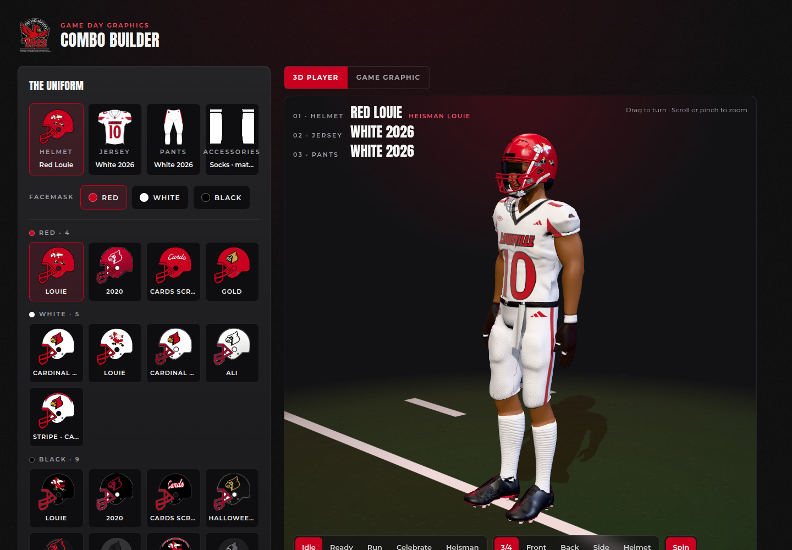

# Uniform Combinations

The Louisville Combo Builder in 3D: pick the helmet, facemask, jersey, pants, socks and cleats from the equipment room, see the whole uniform on a rigged 3D player you can turn, zoom and pose, and export the 1080 × 1080 "The Combo" game graphic with the 3D player in it.



## Run it

No build step or install is needed; it's plain HTML and JavaScript modules.

```bash
npm start            # serves the app on http://localhost:8080
```

**In a GitHub Codespace:** run `git pull`, then `npm start`. Codespaces forwards port 8080 and opens a preview tab. New Codespaces created from this repo start the server for you (see `.devcontainer/devcontainer.json`).

**On GitHub Pages:** publish the repository root. The page loads three.js from jsDelivr and fonts from Google Fonts.

Opening `index.html` straight from disk (`file://`) won't work, because browsers block JavaScript modules there. Use one of the options above.

## What it does

- **The uniform**, laid out like the Combo Builder design: Helmet, Jersey, Pants and Accessories tabs with the design art, options grouped by color (Red, White, Black, Gray), a facemask picker that defaults per helmet, and a helmet callout.
- **Your art on the 3D player.** The jersey front art is projected onto the jersey (sleeves included), the back gets the same number as the front, set larger, plus an optional name in the LOUISVILLE wordmark's slanted capitals, the shoulder numbers go on top of each shoulder pad as flat decals (the whole number, read from the side; cuff numbers stay on the cuffs), helmet decals are cut from the side-view art and placed on both sides (birds face forward, scripts read forward), the helmet's back carries the number and LOUISVILLE on the bumper, and the pants get their hip logos and side stripes, which run the full outside seam from waistband to hem. Shell finishes (gloss, satin, matte), chrome decals and stripes follow each helmet.
- **The game:** vs/at, opponent, date, kickoff, network, venue and the crest, used by the graphic.
- **Game graphic:** a live 1080 × 1080 preview of the design's "The Combo" template with the 3D render in place of the flat art, and a Download button. Plain sets show their color (RED, WHITE, BLACK); alternate sets show their own name (ALI, HALLOWEEN, IRON WINGS, RED GOLD).
- **Poses** (Idle, Ready, Run, Celebrate, Heisman), all played through one three.js `AnimationMixer` that cross-fades between them in 0.25 s, with a subtle procedural sway on top of Idle, **camera views** (3/4, Front, Back, Side, Helmet), drag to turn, scroll or pinch to zoom, and a turntable spin.
- **Saved combos** stay in the browser, and the page address carries the current combo. **Copy link** puts that address on the clipboard so it reopens the same combo.
- **Number and name.** The player wears No. 19 on the front (chest and shoulders) and No. 12 on the back (jersey and helmet), with SOCIETY on the back, by default. Change them under the jerseys: the art's "10" is painted out on the chest, shoulders and back and the new number lettered in each jersey's own style (the Louisville jersey numerals, or block numerals for the Black 2026 and Halloween sets, with drop shadows where the art has them). Where the numbers sit is `JERSEY_NUMBERS` in `src/team.js`.
- **On the 3D player only:** gloves, visor and skin tone, under Accessories.

The header carries the LOUISVILLE wordmark, lifted from the jersey art with its white trap for the dark page. Colors follow the UofL Athletics brand guidelines (Cardinal Red `#C9001F`, black, white, metallic silver `#8A8D8F`) and text is set in Gotham where it's installed, with Montserrat as the web fallback.

## Checks

```bash
npm test
```

Checks that every piece in `LIB` has its art and sampled colors, that the team tables only name real pieces, and that share links round-trip. GitHub runs it on every push and pull request.

## Matching it to your designs

| What | Where |
| --- | --- |
| The pieces, their color groups, tags and art files | `LIB` in `src/team.js` |
| The facemask each helmet comes with | `MASK_DEF` in `src/team.js` |
| The helmet callout each helmet starts with (a typed callout stays when you switch) | `HELMET_NOTE` in `src/team.js` |
| The big word an alternate set shows on the game graphic | `GRAPHIC_WORD` in `src/team.js` |
| Starting combo and game | `DEFAULT_STATE` in `src/team.js` |
| Helmet finish, stripes, chrome decals, scripts that shouldn't mirror | `HELMETS` in `tools/prepare-uniforms.py` |
| How far down the leg a pants side panel runs, where game photos differ from the art | `PANEL_END` in `tools/prepare-uniforms.py` |
| Sleeve bands, where game photos differ from the art (Black 2026) | `JERSEY_SLEEVES` in `src/team.js` |
| Fabric: dimple mesh on the jersey body and pants, smooth yoke, sleeves and socks | `jersey-material/jerseyMaterial.js` (depth, hole shading, sheen) and `MESH_FABRIC` in `src/model.js` (hole size, where the smooth yoke ends); the maps come from `python3 jersey-material/make_mesh_maps.py` (`--style tricot` for a tighter practice mesh) |
| Thread weave over all the cloth, much finer than the holes | `WEAVE` in `src/model.js`; the map comes from `python3 jersey-material/make_weave_map.py` |
| Lighting: studio HDRI (reflections and fill only), one key light with soft shadows, a rim from behind, a contact shadow, ambient occlusion, ACES tone mapping | `src/main.js`; the HDRI is `assets/hdri/studio_small_09_1k.hdr` (Poly Haven, CC0), read by `src/hdr.js`. The HD button switches High quality (ambient occlusion via three's GTAOPass, vendored in `src/vendor/`, 2048 px shadows) and Low (no AO, 1024 px shadows, lower pixel ratio), the default on phones |
| Fit: tucked-in jersey (`untucked: true` hangs it over the belt), broader shoulders (pushed out from the shoulder joint, fading before the cuff), fuller thighs and knees | `JERSEY_FIT` and `fitUniform()` in `src/model.js` (rest-pose edits solved back through the skinning) |
| Body never shows through the clothes | `hideCovered()` cuts away the skin under the jersey and pants, `JERSEY_PUFF` sets the jersey a few millimeters out over the body, and the skin draws behind coincident cloth (polygonOffset) |

To add or update art, put the design's PNGs in a folder with their original names (`helmet-red-mask-red.png`, `jersey-red.png`, `pants-red.png`, `socks-red.png`, `shoes-red.png`, plus `1912-crest-outline.png` and `bird_master.png`) and run:

```bash
pip install pillow numpy
npm run prepare:uniforms -- path/to/art
```

It writes WebP copies to `assets/uni/`, cuts out the helmet decals and pants logos, and samples the colors and side-panel stripes the 3D materials use into `src/uniform-art.js`. The jersey projection assumes the design's jersey template (1366 × 1408, V-neck tip at y = 380, armpits at y = 540, sleeves drawn hanging); the landmarks are `JERSEY_ART` in `src/model.js`. Cleats wear the side-view shoe art, projected along each foot.

## The 3D models

The app loads two web-ready models from `assets/`:

| File | From | Notes |
| --- | --- | --- |
| `player.glb` | `3x.fbx` (Mixamo-rigged player with an idle animation) | Materials are renamed by part: `jersey`, `pants`, `socks`, `cleats`, `skin`, `belt`, `tape`, `armSleeve`. The FBX's own helmet is removed. |
| `helmet.glb` | `bucshelmet.obj` | Split into `shell`, `mask`, `strap`, `cup`, `bumper`, `trim`, `pads`, `hardware`; faces +z and is scaled to a shell width of 1. |

To rebuild them from the source files:

```bash
npm install
node_modules/fbx2gltf/bin/Linux/FBX2glTF --binary --input 3x.fbx --output player-raw   # Darwin/ or Windows_NT/ on other systems
npm run prepare:player -- player-raw.glb assets/player.glb
npx obj2gltf -i bucshelmet.obj -o helmet-raw.glb --binary
npm run prepare:helmet -- helmet-raw.glb assets/helmet.glb
```

The art is mapped from measurements taken on the model at load time (`measure()` in `src/model.js`), so it follows the cloth as the player moves.

Idle is the model's own Mixamo clip. The other poses are written as joint angles in `POSES` (`src/model.js`) and baked into looping `AnimationClip`s when the player loads (`bakePose()`), so every pose is an `AnimationAction` on the same mixer. A new Mixamo clip (a touchdown dance, say) can join them the same way: add its clip to `buildActions()` and a button in `POSE_LABELS` (`src/main.js`).

Make sure you have the rights to publish the models, the art, the marks and the jersey font (`assets/fonts/louisville-jersey.otf`) before making the repository or the page public.

## Project layout

```
index.html            page shell
src/main.js           renderer, lighting, turf, wiring, game graphic, saved combos
src/model.js          loads the player and helmet, dresses them in the art, poses the rig
src/textures.js       jersey art for projection, back lettering, ball, turf
src/ui.js             The Uniform, The Game and Saved Combos panels
src/combo.js          state checks, piece names, the 3D look for a combo, share links
src/team.js           the uniform library and brand colors (edit this one)
src/uniform-art.js    colors and placements sampled from the art (generated)
src/orbit.js          camera controls and preset views
src/vendor/           three.js GLTFLoader (MIT), sharing src/three.js
src/styles.css        styles
assets/               player.glb, helmet.glb, uni/ art, fonts/
jersey-material/      Doc's fabric kit: jerseyMaterial.js, its maps/ and the script that makes them
tools/                scripts that build the models and the art
test/                 npm test checks for the combo data and share links
server.mjs            zero-dependency static server for local and Codespaces use
```
